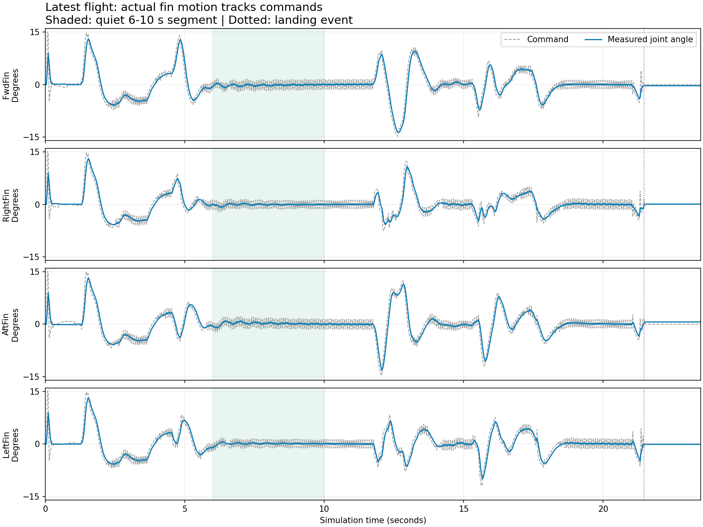

# Physics and fin-motion audit - 2026-09-27

Latest completed mission: `c1192bd6446c`. Earlier pre-editor reference: `310b70262653`.

No evidence that the waypoint/editor changes weakened, disabled, or froze the fins. The physical model and recorded configuration match the earlier reference; guidance and mission behavior have changed.

## Evidence

- All 9 compared metadata fields are identical: asset_sha256, physics_parameters, physics, dynamics, battery_model, physics_dt, decimation, hinge_layout, fin_link_names.
- All 26 recorded dynamics, simulation and parameter source hashes match the earlier flight. Every current source hash matches the latest recording.
- Physics step remains 0.00833 s (~120 Hz), with 4 substeps per control interval (~30 Hz).
- Servo limit remains 0.262 rad (~15 degrees), deadband 0.017 rad (~0.97 degrees), lag 0.05 s. No fin gain or actuator parameter was adjusted during this audit.
- Full recording contains 706 frames over 23.49060 simulated seconds, including shutdown settling.
- Latest flight landed successfully at 21.458 s; reported impact speed 0.161 m/s and final pad distance 0.021 m.

| Fin | Peak absolute command (deg) | Peak absolute measured angle (deg) | Maximum pose/joint discrepancy (deg) |
| --- | ---: | ---: | ---: |
| FwdFin | 15.011 | 13.598 | 0.000039 |
| RightFin | 15.011 | 13.077 | 0.000038 |
| AftFin | 15.011 | 13.208 | 0.000035 |
| LeftFin | 15.011 | 13.191 | 0.000038 |

Pose check: compute each recorded fin quaternion relative to the body, remove its initial orientation, and compare its rotation magnitude with the absolute measured joint displacement. This checks the articulated poses supplied to replay, not only the displayed angle numbers. Replay still interpolates those recorded fin poses.

## Why some segments look quiet

Between 8 and 10 s, the largest measured deflection across all fins is 0.596 degrees. This flight has no disturbances and uses slow waypoint speeds (1.0, 1.2, 0.7 m/s). Small corrections during a settled segment are consistent with those conditions and the existing servo deadband. During launch and descent the same fins move to roughly 13 degrees. The latest individual corridors are 0.25 m, narrower than the preceding comparison flights; that changes guidance requests, not the physical actuator model.

## Scope and limits

The working-tree changes versus Git HEAD include launch/landing contact bookkeeping: explicit ground takeoff must lift off before a LANDED declaration is armed, and launch-settling impact telemetry is cleared after liftoff. Contact forces, collision dynamics, crash checks, fin force equations and integration settings were not altered by that change. Guidance constraints and waypoint references were edited, so command histories need not match different plans.

The latest flight uses `fast_live=false`; render throttling cannot explain its motion. This audit establishes consistency with the earlier recorded model, not independent validation against hardware or every historical simulator version. In particular, the earlier migration from legacy vanes to momentum-bounded vanes predates the waypoint work.

## Validation

83 physics unit tests passed: radial hinges, physics review, link force interface, gyro midpoint, fin geometry, fin force dispatch, fin aerodynamics, coupled jet, contacts and LiPo battery.

28 convex-guidance/controller tests also passed, including existing servo deadband compensation coverage (111 tests total).

