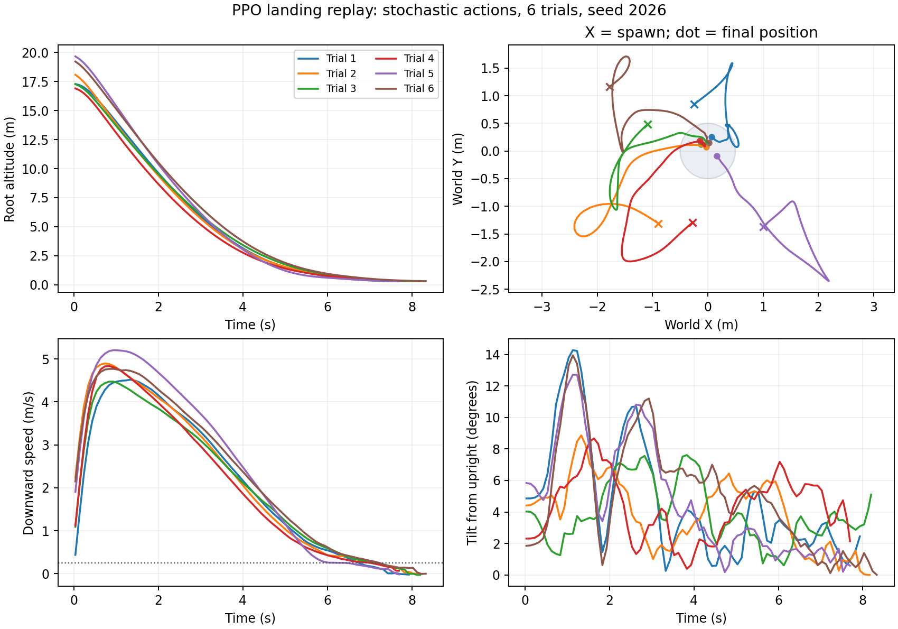
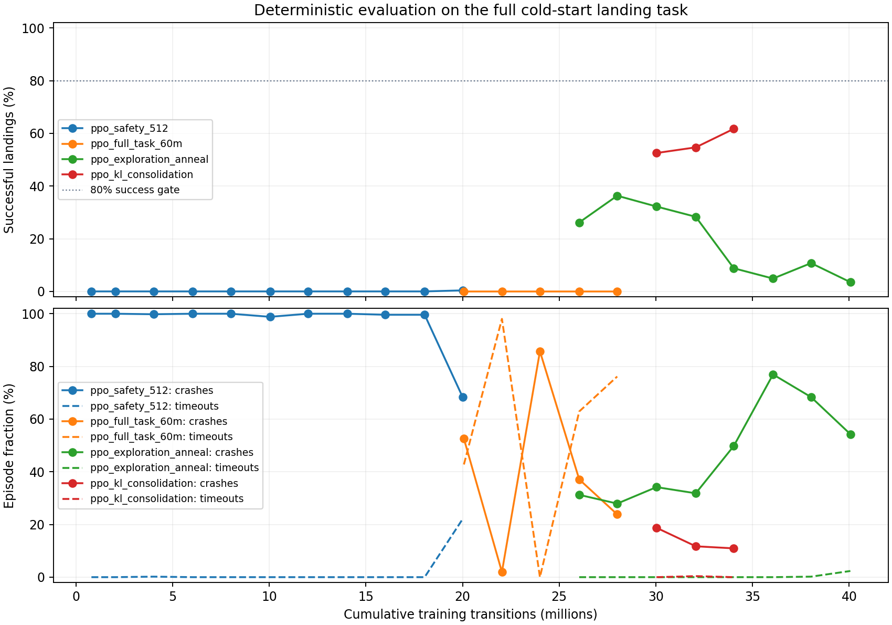

# PPO landing validation — September 13, 2026

> September 14 correction: these are historical results for the previous
> tangential hinge axes and ideal-voltage 6S model. The user confirmed radial
> hinge spans; the USD joints and aerodynamic axes have since been corrected.
> The percentages below do **not** validate the corrected mechanism or the
> planned 8S battery-coupled task. See `mission_control.md` and the new radial
> training/evaluation records. Original evidence is retained for reproduction.

The learned stochastic PPO policy achieves **3,002 successful landings in 3,072
independent nominal trials (97.72%)**, with 18 crashes (0.59%) and no timeouts.
This passes the existing simulation gate of at least 80% success and at most 5%
crashes. These results use sampled actions from the saved Gaussian policy.
Deterministic `tanh(mean)` inference is a different behavior and remains weaker.

## Selected policy and task

- Checkpoint: `runs/ppo_exploration_anneal/ppo_landing_seed0_20260911_184222/ppo_step_26034176.pt`
- SHA-256: `ac786a14bf2383faea4e620549950a811ac98a89c1c955339f1206882630e924`
- Inference: `--action-mode stochastic`, sampling the checkpoint's learned
  Gaussian at each control step, then tanh and normal actuator scaling.
- Architecture: feed-forward 24-input, two-layer 256-unit actor and critic;
  this is the PPO baseline, not a trained GTrXL.
- Final task: cold rotor, altitude 16–20 m, XY ±2 m, original randomized
  velocities and attitudes, 30-second limit, corrected Isaac physics.
- Success: LANDED, horizontal error ≤0.5 m, worst arrival speed across contacts
  and bounces ≤0.25 m/s. No PID residual, behavior cloning, or guidance wrapper.

The checkpoint remains in its original experiment directory; a hash-identified
pointer and aggregate metrics are saved in `runs/validated_landing_ppo/policy_manifest.json`.

## Independent measurements

| Test | Trials | Successful | Crashes | Timeouts |
| --- | ---: | ---: | ---: | ---: |
| Nominal, reset seeds 789–790 | 1,024 | 1,002 (97.85%) | 4 | 0 |
| Nominal, reset seeds 2026–2029 | 2,048 | 2,000 (97.66%) | 14 | 0 |
| Sensor noise, seed 4321 | 512 | 501 (97.85%) | 1 | 0 |
| Wind/gust configuration, seed 8765 | 512 | 502 (98.05%) | 1 | 0 |
| COM offset ±1 cm, seed 9753 | 512 | 480 (93.75%) | 3 | 0 |
| Single-environment replay, seed 2026 | 6 | 6 (100%) | 0 | 0 |

The nominal combined 95% Wilson interval is 97.13–98.19% for success and
0.37–0.92% for crashes. Among nominal LANDED trials, mean recorded impact speed
is 0.15682 m/s and mean pad error is 0.21739 m. These means include unsuccessful
hard/off-pad landings; they do not mean every touchdown was within limits.

Sensor noise uses the repository configuration: position σ=0.01 m, velocity
σ=0.05 m/s, attitude σ=0.005 rad, angular velocity σ=0.02 rad/s. Wind evaluation
uses the existing 2.0/0.5/0 m/s steady wind and 5 m/s, 0.5-second gust setting;
it also uses that file's configured body drag area. These are separate scenario
tests, not a claim that every combination of disturbances was evaluated.

Per-episode initial conditions and full-precision success classification are in
`runs/ppo_holdouts/full26m_seed789_stochastic`, `full26m_seed2026_stochastic`,
`full26m_seed4321_sensor_noise`, and `full26m_seed8765_wind`. Each directory has
`episodes.jsonl`, `summary.json` and `evaluation_config.json` with checkpoint hash.
The COM-offset scenario is saved as `full26m_seed9753_com_shift`; it independently
randomizes the center of mass by up to 1 cm on each axis using the existing
`configs/disturbances/com_shift.yaml`. Its main residual failure was pad miss
(25 soft off-pad landings). All three separately tested disturbance scenarios
pass the same success/crash gate; combined disturbances were not tested.

The six single-environment replay trials are an additional execution check, not
the statistical basis for the success claim. They all landed within 0.075–0.261 m
of the pad center, with recorded impact speeds 0.090–0.133 m/s.



## Reproduce

From `C:\Transformer-rl-retro-propulsion\simulation\isaac`, use PowerShell:

```powershell
$ppoCheckpoint = 'runs/ppo_exploration_anneal/ppo_landing_seed0_20260911_184222/ppo_step_26034176.pt'
& ..\..\env_isaaclab\Scripts\python.exe apps/run_eval_ppo_batch.py `
  --checkpoint $ppoCheckpoint --action-mode stochastic --episodes 512 `
  --seed 3456 --output-dir runs/ppo_holdouts/replay_seed3456
```

For visible single-environment replay:

```powershell
& ..\..\env_isaaclab\Scripts\python.exe apps/run_eval_ppo.py `
  --checkpoint $ppoCheckpoint --action-mode stochastic `
  --episodes 10 --seed 3456 --no-headless
```

Choose a new output directory for each saved evaluation. Both evaluators default to
deterministic mode; **include `--action-mode stochastic` to reproduce this policy**.

## Continued deterministic training

The original annealing run peaked at 36.33% deterministic success at 28M, then
regressed to 3.52% at 40M. Independent deterministic evaluation of 28M scored
37.30% (191/512). An update-stability correction now checks analytic policy KL
before each minibatch, and continuation from 28M uses learning rate 3e-5 and
target KL 0.015. Its first full-task evaluation at 30,031,872 steps improved to
52.54% success with 18.75% crashes; at 32,063,488 steps it reaches 54.69% success
with 11.72% crashes and 0.39% timeouts. The final 34,029,568-step evaluation
reaches **61.72% success, 10.94% crashes and no timeouts**. The comparison was
stopped cleanly after 6,029,312 additional transitions; its final/best checkpoints
remain resumable in `runs/ppo_kl_consolidation/ppo_landing_seed0_20260913_205810`.
This does not yet pass the deterministic gate.
The validated stochastic checkpoint above remains the selected policy.

Independent deterministic holdout of the final/best 34M checkpoint, reset seed
6543: **319/512 successes (62.30%)**, 65 crashes (12.70%), 3 timeouts, 60 hard
landings (18 also off-pad), and 65 soft off-pad landings. Results are in
`runs/ppo_holdouts/full34m_seed6543_kl_consolidation`. This confirms improvement
on a new seed while keeping the remaining deterministic-policy failure visible.

The full unit suite passes **171 tests**, including policy density, inference
variance, exact KL, contact/physics, rewards and curriculum regressions.



See [experiment lineage](ppo_convergence_2026-09-11.md) for the optimizer,
curriculum, reward and measurement fixes. Physics and PID validation are in
[the physics review](physics_review_2026-09-10.md). Physical parameters still
include estimates; these results validate the stated simulator task, not transfer
to the physical EDF testbed.
